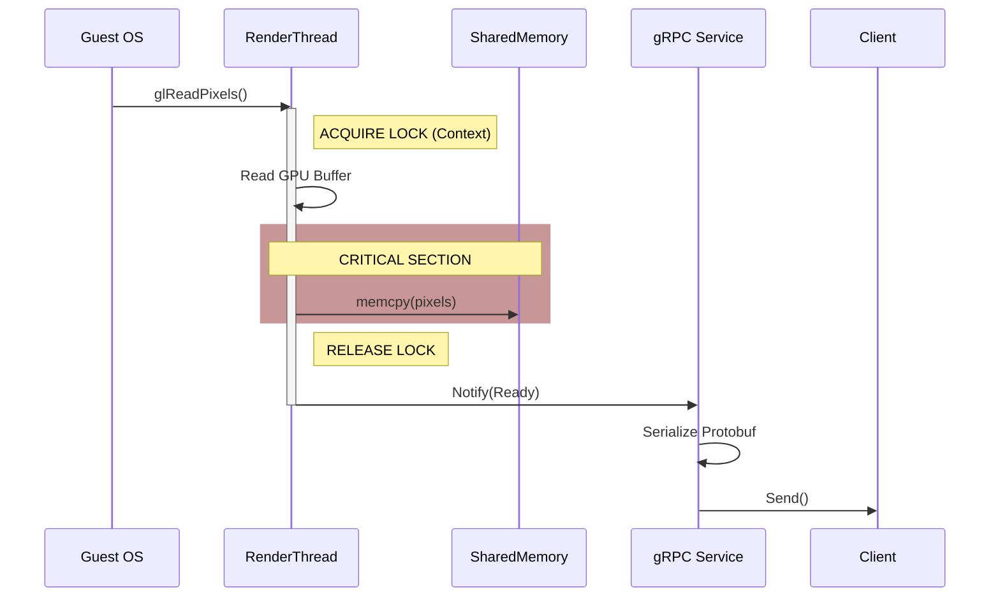
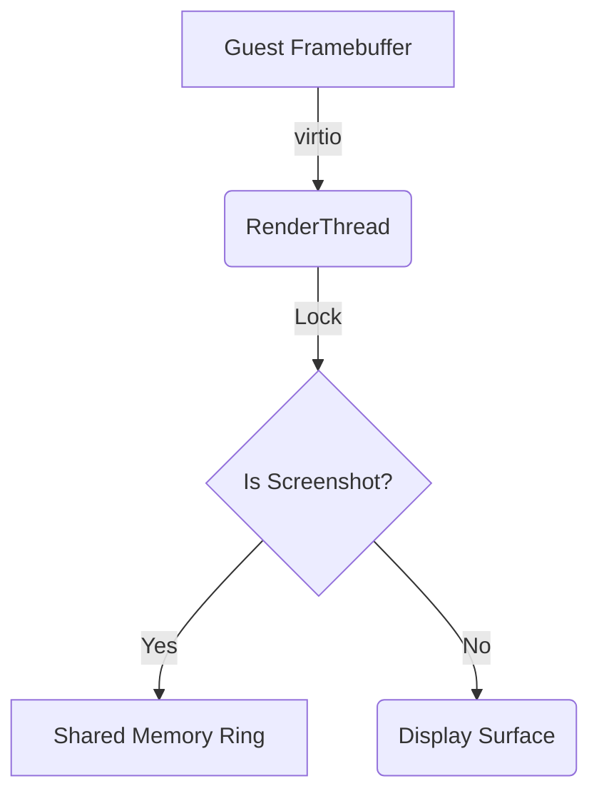

# Mermaid Diagram Standards

When tracing flows, use these patterns to highlight architectural constraints.

## Pattern 1: Sequence with Threading and Locks

Use `Note` to indicate locking and `par`/`alt` for complex logic.

## Pattern 2: Component Data Flow

Use specific shapes to denote component types.

* `[]` Square: Passive Data / Buffer
* `()` Round: Active Thread / Process
* `{}` Rhombus: Logic Gate / Decision

