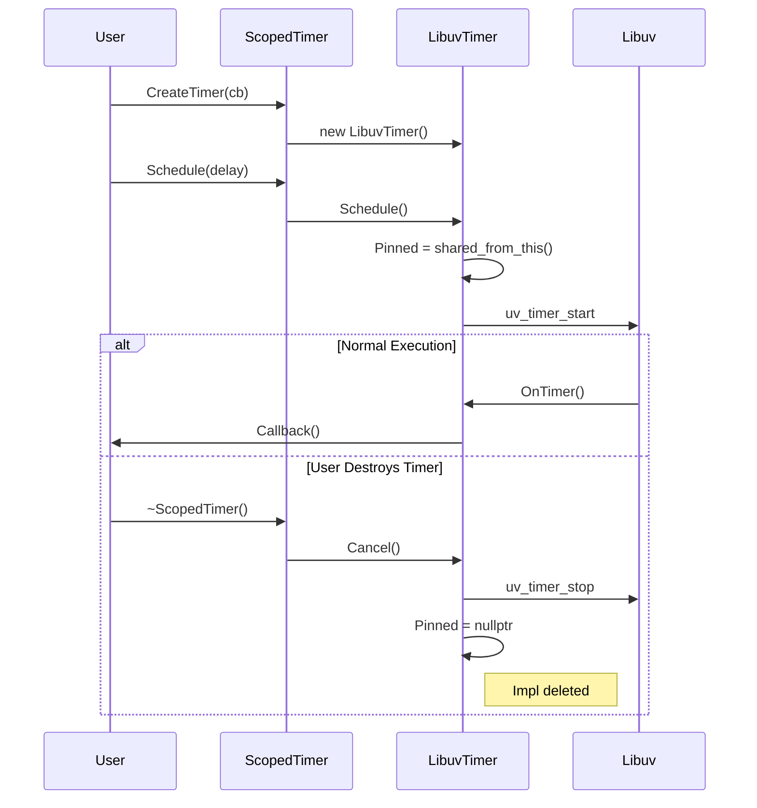

# Event Loop Primitives

This document details the core mechanisms of the `LibuvEventLoop`, specifically how it handles cross-thread task scheduling and time-based events.

## 1. Task Scheduling (Thread Safety)

The `EventLoop` guarantees that all callbacks (sockets, timers, tasks) run on a single dedicated thread. To achieve this from other threads, it uses a **Producer-Consumer** queue guarded by a mutex and signaled via `uv_async_send`.

### Flow Diagram

```mermaid
sequenceDiagram
    participant Caller as Any Thread
    participant Loop as LibuvEventLoop
    participant Queue as std::queue<Task>
    participant Libuv as libuv (uv_async)

    Note over Caller, Libuv: Thread: Any

    Caller->>Loop: Post(Task)
    Loop->>Queue: push(Task) (Locked)
    Loop->>Libuv: uv_async_send(async_handle)
    Note right of Libuv: Wakes up Loop Thread

    Note over Caller, Libuv: Thread: Loop Thread

    Libuv->>Loop: AsyncCallback()
    Loop->>Queue: swap(local_queue) (Locked)

    loop For each Task
        Loop->>Loop: Task()
    end
```

### Key Components
*   **`uv_async_send`**: A thread-safe libuv primitive that "pokes" the event loop, causing it to wake up from its blocking wait (poll) and execute a callback.
*   **`task_mutex_`**: Protects the shared task queue.
*   **`ProcessTasks`**: The internal method that drains the queue. It swaps the queue to minimize the time the lock is held.

---

## 2. Timers & RAII (ScopedTimer)

Timers in this library uses a strict **RAII (Resource Acquisition Is Initialization)** pattern. The `ScopedTimer` class ensures that timers are automatically cancelled when they go out of scope, preventing common bugs like use-after-free in callbacks.

### The "Pinning" Mechanism
The underlying `LibuvTimer` must stay alive as long as libuv might call it. To handle this:
1.  **Creation:** `LibuvTimer` creates a `shared_ptr` to itself ("pins") when scheduled.
2.  **Execution:** The callback runs.
3.  **Cleanup:**
    *   **One-Shot:** The timer unpins itself (deletes) after running.
    *   **Recurring:** Stays pinned until Cancelled.
    *   **Destruction:** If `ScopedTimer` dies, it calls `Cancel()`, which forces the `LibuvTimer` to stop and unpin.

### Lifecycle Diagram


