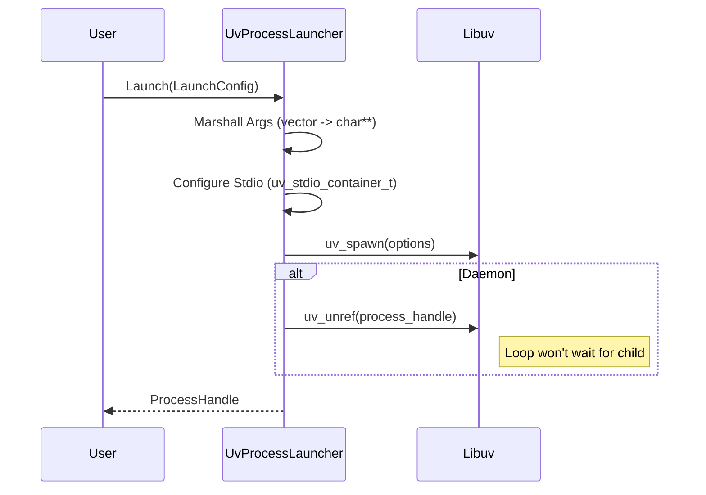

# Process Launching

The `UvProcessLauncher` provides a high-level C++ wrapper around libuv's `uv_spawn`. It abstracts the complexity of argument marshalling and stdio redirection.

## Features

*   **Daemonization:** Can launch processes that persist after the parent exits (`UV_PROCESS_DETACHED`).
*   **Stdio Inheritance:** Configurable option (`keep_stdio`) to pass `stdout`/`stderr` to the child.
*   **Type Safety:** Uses `std::filesystem::path` and `std::vector<string>` instead of raw C-arrays.

## Flow

