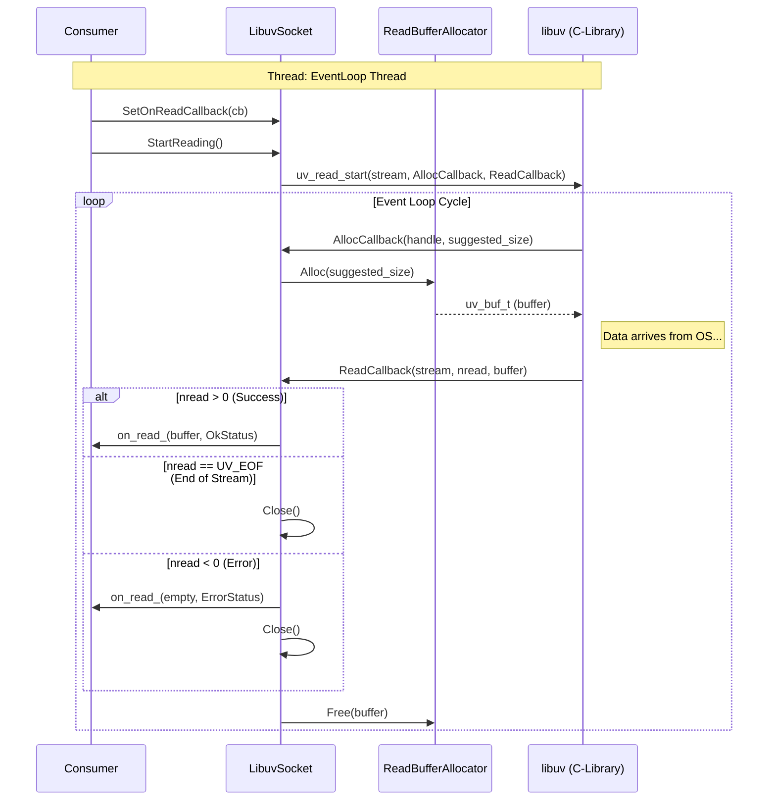

# Socket Read Lifecycle

This flow details how `LibuvSocket` (in `libuv_sockets.cc`) handles asynchronous reads, bridging C-style libuv callbacks to C++ `std::function` callbacks.

## Flow Diagram

## Key Components

*   **`LibuvSocket::StartReading`**: Registers the static lambdas with libuv.
*   **`ReadBufferAllocator`**: Manages a small pool of buffers to minimize `malloc/free` overhead.
*   **`uv_read_start`**: The libuv primitive that triggers the reactor pattern.
