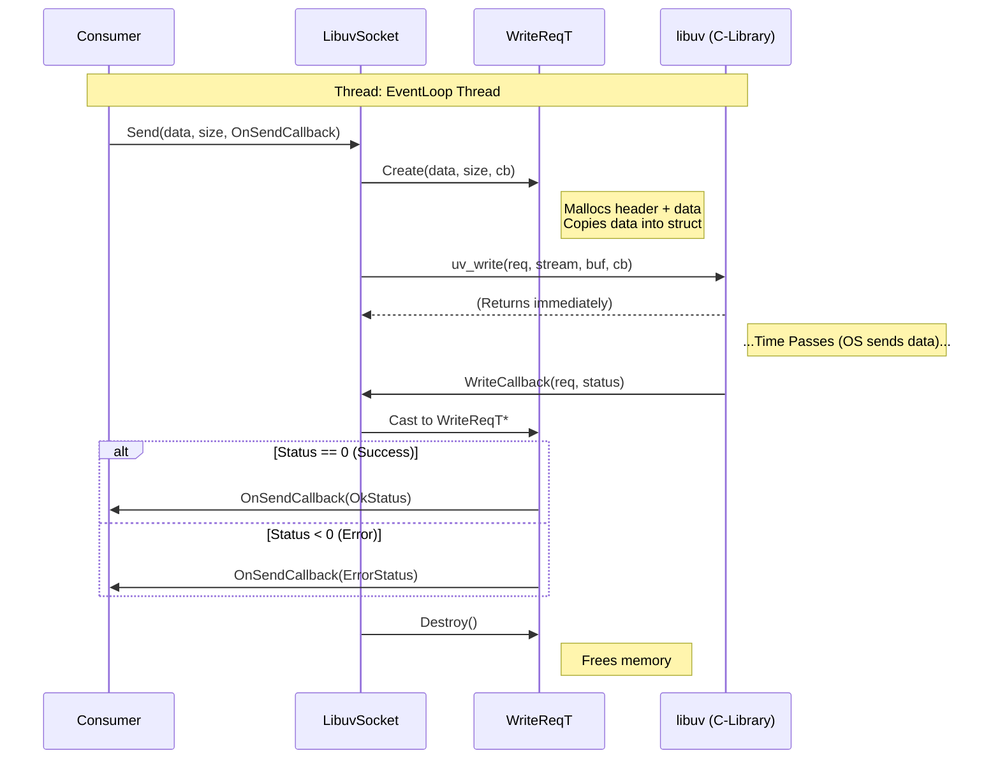

# Socket Write Lifecycle

This flow details how `LibuvSocket` handles asynchronous writes. It uses a custom request wrapper (`WriteReqT`) to manage the lifetime of the write buffer and the completion callback.

## Mechanism

1.  **Request Creation:** When `Send` is called, a `WriteReqT` is allocated. This struct contains the `uv_write_t` handle, the `uv_buf_t` descriptor, and the user's completion callback.
2.  **Buffer Copy:** The data to be sent is **copied** into the `WriteReqT` allocation. This ensures the data remains valid until libuv is done with it, even if the user's buffer goes out of scope.
3.  **Dispatch:** `uv_write` is called to queue the request with libuv.
4.  **Completion:** Libuv invokes the static callback, which triggers the user's callback and frees the `WriteReqT`.

## Flow Diagram

## Key Components

*   **`WriteReqT`**: A self-contained struct that couples the libuv request handle with the payload and the user callback. This solves the "user data lifetime" problem common in async C APIs.
*   **`uv_write`**: The non-blocking call that queues the buffer. It does **not** guarantee the data is on the wire when it returns, only that it has been accepted.
*   **Callback Guarantees**: The user's `OnSendCallback` is guaranteed to be called exactly once per `Send` call, indicating whether the OS accepted the data (or if it failed).
