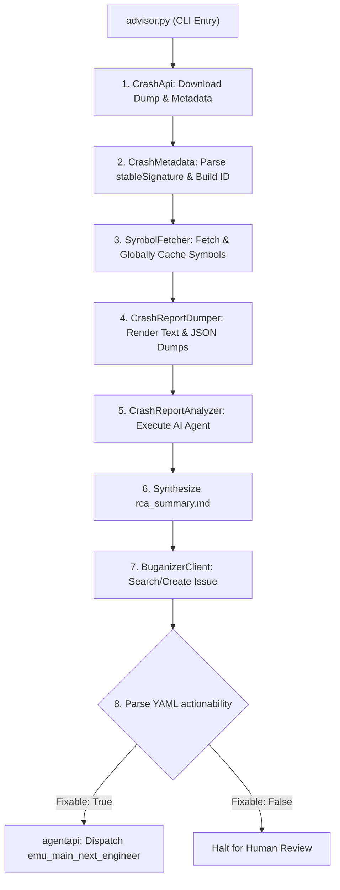

<!--
Copyright 2026 The Android Open Source Project

Licensed under the Apache License, Version 2.0 (the "License");
you may not use this file except in compliance with the License.
You may obtain a copy of the License at

     http://www.apache.org/licenses/LICENSE-2.0

Unless required by applicable law or agreed to in writing, software
distributed under the License is distributed on an "AS IS" BASIS,
WITHOUT WARRANTIES OR CONDITIONS OF ANY KIND, either express or implied.
See the License for the specific language governing permissions and
limitations under the License.
-->

# CrashAdvisor (`emulator/crashreport/tool/advisor`)

**CrashAdvisor** is an automated, AI-powered minidump diagnostic pipeline and Root Cause Analysis (RCA) assistant built for the Android Emulator (`aemu`).

Given a crash ID or `go/crash` URL, CrashAdvisor automatically fetches symbols, generates local crash dumps (including looper timelines), and provisions an AI agent to investigate the root cause. It can optionally manage Buganizer tickets and dispatch autonomous agents to write fixes.

---

## Quick Start

### Step 1: Fetch an OAuth2 Token
*Required for `go/ab` and Buganizer API access.*

Run `oauth2l` on your GLinux workstation or Cloudtop. (The `reset` command clears stale caches first):

```bash
oauth2l reset && oauth2l fetch --sso $USER@google.com https://www.googleapis.com/auth/buganizer https://www.googleapis.com/auth/androidbuild.internal
```

### Step 2: Run CrashAdvisor
Execute the tool via Bazel from your workspace root. Replace `<CRASH_ID>` with your target ID and `<TOKEN>` with the output from Step 1.

#### Interactive Mode (Default)
Downloads assets and generates an interactive `jetski` script for collaborative debugging.
```bash
bazel run @goldfish//emulator/crashreport/tool/advisor -- <CRASH_ID> --token "<TOKEN>"
```
*Next step:* Run the generated script (e.g., `/tmp/crashadvisor_$USER/<CRASH_ID>/investigation_cmd.sh`) to open the AI REPL (`jetski> `).

#### Automated Batch Mode (`--auto-run`)
Runs the investigation in the background and writes the RCA directly to `rca_summary.md`, skipping the interactive prompt.
```bash
bazel run @goldfish//emulator/crashreport/tool/advisor -- <CRASH_ID> --token "<TOKEN>" --auto-run
```

#### Custom Execution Timeout (`--timeout`)
Sets the maximum execution time for the underlying AI investigation CLI (default: `30m`). Useful for intensive batch mode investigations across large workspaces.
```bash
bazel run @goldfish//emulator/crashreport/tool/advisor -- <CRASH_ID> --token "<TOKEN>" --auto-run --timeout 45m
```

#### Closed-Loop Buganizer Mode (`--enable-buganizer`)
*Must be used with `--auto-run`.* Creates or updates the relevant Buganizer issue and hands off fixable bugs to an autonomous engineering agent (`emu_main_next_engineer`). 
```bash
bazel run @goldfish//emulator/crashreport/tool/advisor -- <CRASH_ID> --token "<TOKEN>" --auto-run --enable-buganizer
```

---

## Architecture & Pipeline

CrashAdvisor is built on a modular, test-driven pipeline that handles ingestion, symbolication, and AI handoff.



### Pipeline Stages

*   **Context & Ingestion:** Parses the URL/ID, creates an isolated sandbox (`/tmp/crashadvisor_$USER/<crash_id>/`), and downloads `metadata.json` and `minidump.dmp`.
*   **Metadata Decoding:** Extracts the `stableSignature`, `build_id`, and target platform triples (e.g., `emulator-linux_x64_gfxstream`).
*   **Global Symbol Caching:** Streams Breakpad archives from `go/ab` and caches them globally by `build_id` to eliminate redundant network fetches across different crashes from the same build.
*   **Local Dump Generation:** Uses Bazel runfiles to execute the C++ `crashreport` binary, outputting human-readable text (with Mermaid looper timelines) and machine-readable JSON.
*   **AI Investigation Scripting:** Configures `jetski` or `gemini` with the `crash_advisor.md` persona, `pro` model tier, and AOSP workspace bindings.
*   **Buganizer Management:** Uses the `stableSignature` to deduplicate issues in Component `29601`. Automatically creates bugs, reopens regressions, or appends the RCA summary. Includes exponential backoff for HTTP 429/503 errors.
*   **Autonomous Multi-Agent Handoff:** Checks `rca_summary.md` for a standardized YAML `actionability` block. If `fixable: true`, it applies an `AI-Engineer-Dispatched` tag (preventing recursive loops) and triggers `emu_main_next_engineer` to draft and verify a Gerrit CL via `repo upload`.