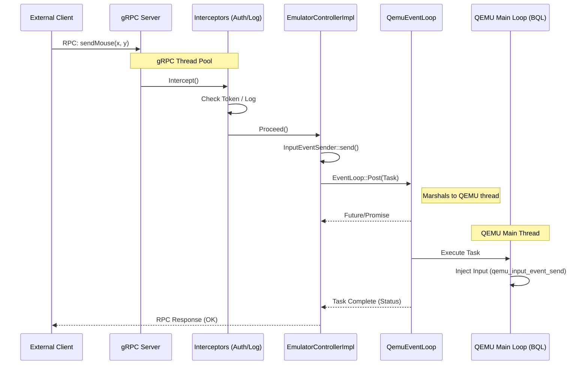

# gRPC Request Flow

This document details the lifecycle of an incoming gRPC request (e.g., `sendMouse`) from an external client.

## Flow Diagram

## Key Mechanisms

1.  **Interception:** Before the service logic runs, the request passes through the `AuthMetadataProcessor` (Token check) and `LoggingInterceptor` (Audit).
2.  **Marshalling:** Most emulator state (VM, Devices) is protected by the **Big QEMU Lock (BQL)** and must be accessed from the main thread. The service implementation uses `goldfish::async::EventLoop` (specifically `QemuEventLoop`) to post a task to that thread.
3.  **Synchronization:** Synchronous RPCs block the gRPC thread waiting for the QEMU task to complete. Asynchronous/Streaming RPCs use reactors to handle completions without blocking.
