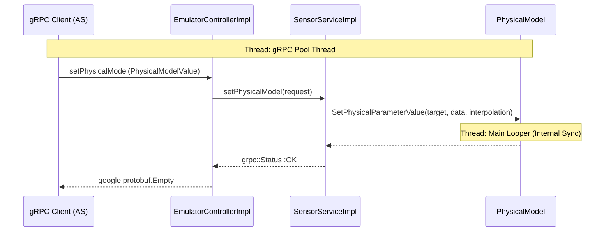

# Physical Model Rotation Flow

This document traces the execution flow of a `setPhysicalModel` call from a gRPC client (e.g., Android Studio) to the emulator's physical model.

## Sequence Diagram

## Step-by-Step Execution

1.  **gRPC Call:** The client sends a `setPhysicalModel` request containing a `PhysicalModelValue` (e.g., with `target=ROTATION` and new Euler angles).
2.  **Service Entry:** `EmulatorControllerImpl::setPhysicalModel` (in `emulator_service.cc`) receives the call on a gRPC thread.
3.  **Delegation:** It calls `mSensorService.setPhysicalModel(request)`.
4.  **Backend Interaction:** `SensorServiceImpl::setPhysicalModel` (in `sensor_service.cc`) translates the gRPC request into a call to `mPhysicalModel.SetPhysicalParameterValue`.
5.  **State Update:** `PhysicalModel` (in `physical_model.cc`) updates its internal state. If interpolation is requested, it starts an interpolation process; otherwise, it updates the values immediately.
6.  **Completion:** The call returns up the stack, and a success status is sent back to the client.
