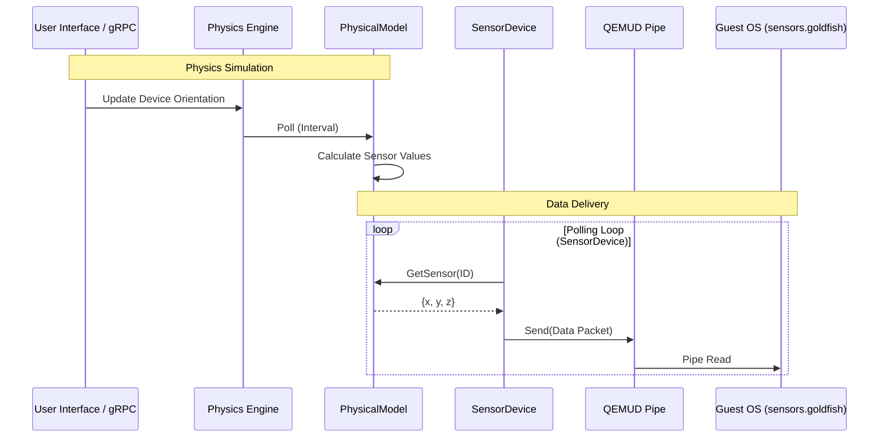

# Sensor Update Flow

This document details how physical sensor data (accelerometer, gyroscope, etc.) propagates from the physics engine to the guest OS.

## Flow Diagram

## Key Components

1.  **Physics Engine:** Calculates the "truth" of the device state (gravity vector, magnetic north) based on user inputs (rotation, location).
2.  **PhysicalModel:** Translates the raw physics state into specific sensor readings (e.g., adding noise, bias, or quantizing to the sensor's resolution).
3.  **SensorDevice:** Runs a polling loop (driven by the guest's requested sampling rate). It queries the `PhysicalModel` and pushes data frames over the QEMUD pipe.
