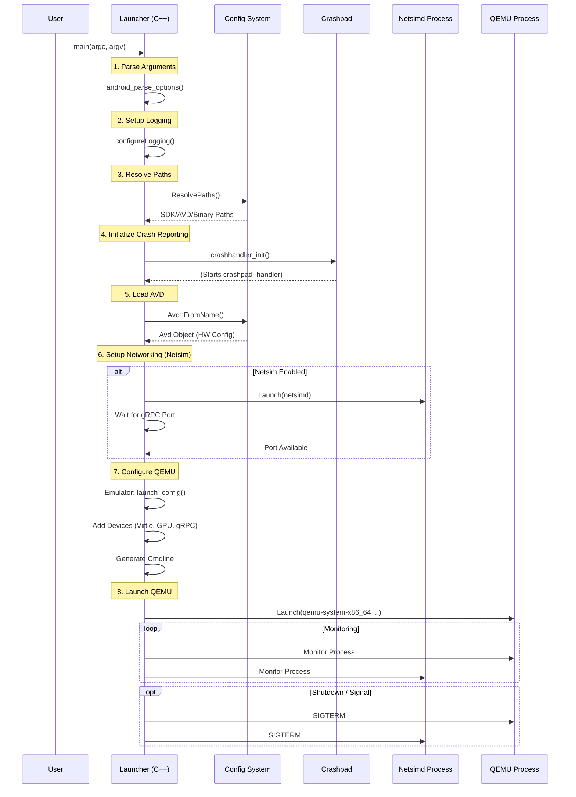

# Emulator Startup Lifecycle

This document details the initialization sequence of the `emulator` launcher binary. It coordinates the setup of the environment, helper processes, and the core QEMU engine.

## Flow Diagram

## Key Phases

1.  **Environment Resolution:** Determining where the SDK, system images, and AVD data reside is critical and complex due to the variety of supported platforms and directory structures.
2.  **Process Orchestration:** The launcher acts as a supervisor. It spawns `netsimd` and `qemu` and ensures they are cleaned up when the emulator exits.
3.  **Device Configuration:** The `Emulator` class translates high-level AVD properties (e.g., "Pixel 4", "API 34") into granular QEMU command-line arguments (`-device virtio-input`, `-drive ...`).
