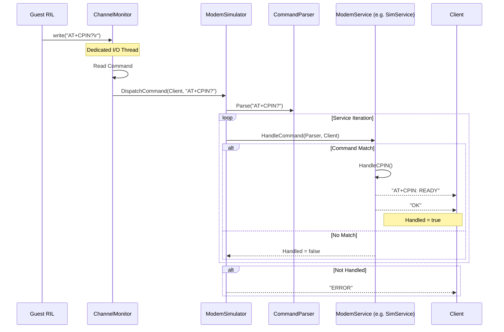

# AT Command Flow

This document details how the Modem Simulator processes AT commands received from the guest's RIL (Radio Interface Layer).

## Flow Diagram

## Key Components

1.  **ChannelMonitor:** Listens on the socket connected to the guest RIL. When data arrives, it buffers it until a complete command (terminated by `\r` or `\n`) is received.
2.  **Dispatch:** The `ModemSimulator` iterates through all registered services (`SimService`, `NetworkService`, etc.) asking each if it can handle the command.
3.  **CommandParser:** Provides a tokenizer for the service to check the command prefix (e.g., `+CPIN`) and parse arguments.
4.  **Response:** The service writes the response directly back to the `Client` object, which wraps the socket file descriptor.