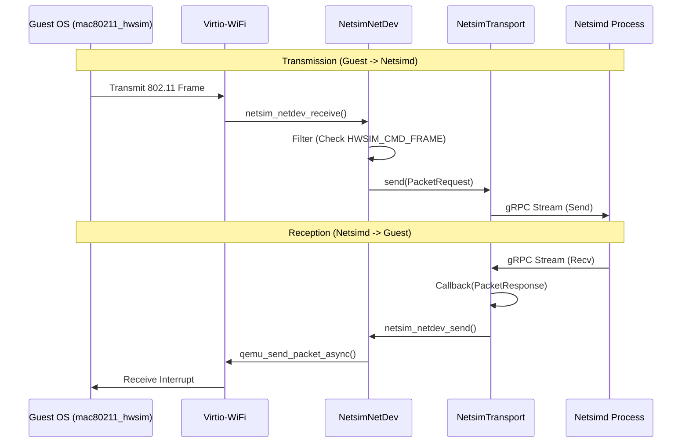
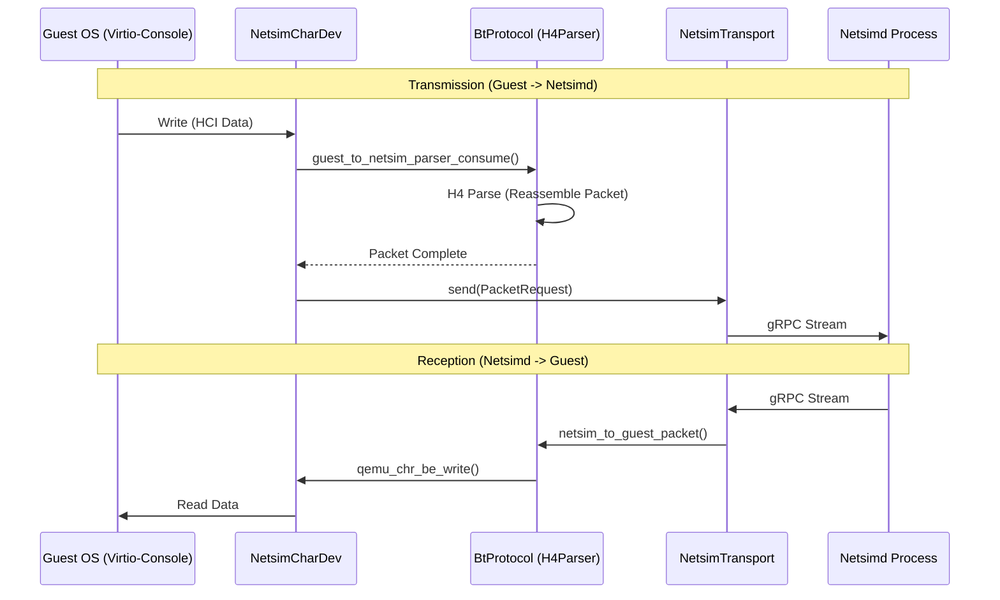

# Netsim Packet Flow

This document details how 802.11 (WiFi) and HCI (Bluetooth) frames are routed between the Android Guest OS and the `netsimd` process.

## WiFi Packet Flow (NetDev)

The `netsim-netdev` plugin implements a QEMU Network Backend (`NetClient`).

## Bluetooth/UWB Packet Flow (CharDev)

Bluetooth and UWB use a QEMU Character Device backend (`netsim-chardev`).

