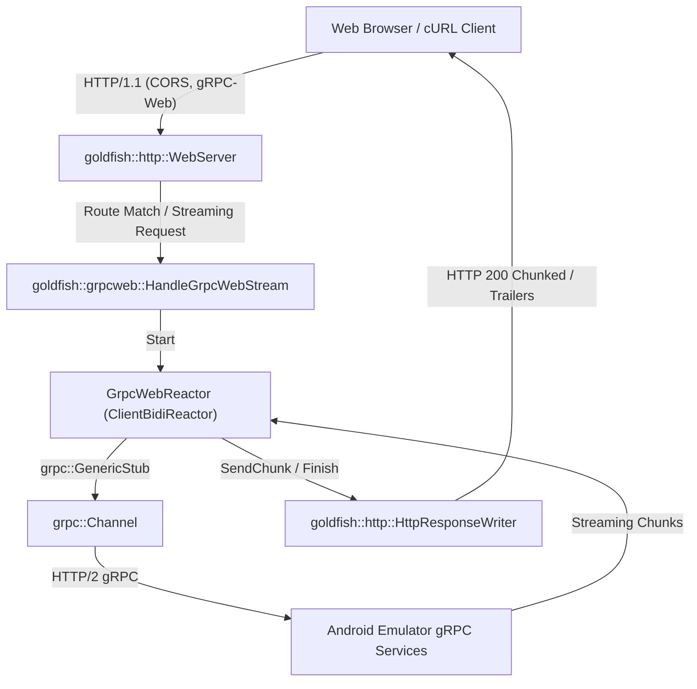

# Component: In-Process gRPC-Web Proxy

**Role:** High-performance, zero-allocation C++17 HTTP/1.1 to gRPC bridge embedded directly in the emulator stack, allowing web browsers (JavaScript / TypeScript `@grpc/grpc-web`) to communicate natively with emulator gRPC services without external sidecars (Envoy).
**Location:** `hardware/generic/goldfish/emulator/tools/grpc-web`
**Namespace:** `goldfish::grpcweb`

---

## Integration Guide

| Class / Interface | Bazel Target | Header Path | Description |
| :--- | :--- | :--- | :--- |
| `Protocol` | `:grpc_web_protocol` | `include/goldfish/grpcweb/grpc_web_protocol.h` | Pure protocol serialization: 5-byte framing, Base64 transcoding, percent encoding, and timeout parsing. |
| `GrpcWebServer` | `:grpc_web_server` | `include/goldfish/grpcweb/grpc_web_server.h` | In-process gRPC-Web proxy server wrapping `goldfish::http::WebServer` with CORS, routing, and streaming gRPC translation. |
| `grpc-web-proxy` | `:grpc-web-proxy` | `src/main.cc` | Standalone CLI proxy daemon with emulator auto-discovery, discovery file resolution, and signal handling. |

---

## Critical Infrastructure

* **Asynchronous Callback Reactor (`GrpcWebReactor`):** Implements `grpc::ClientBidiReactor<grpc::ByteBuffer, grpc::ByteBuffer>` using the modern gRPC C++ Callback API. Interacts directly with thread-safe `goldfish::http::HttpResponseWriter`.
* **Zero-Allocation HTTP Parsing (`goldfish::http`):** Built directly on `goldfish::http::WebServer` and `goldfish::http::HttpSession`, handling HTTP/1.1 framing, keep-alive, and chunked transfer encoding.
* **Non-Blocking I/O (`goldfish::async`):** Employs `LibuvEventLoop`, `AsyncSocket`, and `AsyncSocketServer` for high-throughput, event-driven networking.
* **Auto-Discovery Integration:** Uses `goldfish::discovery::EmulatorAdvertisement` to automatically locate active emulator `.ini` discovery files, resolving dynamic gRPC ports and bearer tokens with zero configuration.

---

## Component Architecture

---

## Threading Model & Invariants

* **Event Loop Thread:**
  * All `AsyncSocket` operations (`Send()`, `Close()`, `SetOnReadCallback()`) and `HttpSession` parsing execute strictly on the socket's `LibuvEventLoop` thread.
* **gRPC Callback Threads:**
  * Upstream gRPC reactions (`OnReadDone`, `OnWriteDone`, `OnDone`) are invoked asynchronously on gRPC's internal thread pool.
* **Thread-Safe Response Streaming:**
  * `HttpResponseWriter` (`writer_->SendHeaders()`, `writer_->SendChunk()`, `writer_->Finish()`) provides thread-safe dispatch from gRPC callback threads back to the event loop.
* **Immediate Disconnect Propagation:**
  * Client socket disconnection triggers `HttpResponseWriter::SetOnCloseCallback()`, invoking `context->TryCancel()`, immediately canceling upstream streaming on the emulator and preventing dangling resources.

---

## Protocol & Security Invariants

* **5-Byte Framing:** Every request and response message payload is formatted with a 1-byte flag (`0x00` = data, `0x80` = trailing metadata) followed by a 4-byte big-endian payload length.
* **Transcoding Formats:** Supports both `application/grpc-web+proto` (binary protobuf) and `application/grpc-web-text` (Base64-encoded protobuf payload and trailers).
* **Trailer Encoding:** Status codes and error details are delivered as HTTP trailer metadata (`grpc-status`, `grpc-message`, `grpc-status-details-bin`) encoded within a `0x80` frame.
* **CORS Preflight & Origin Validation:**
  * Handles `OPTIONS` with `204 No Content` and appropriate `Access-Control-Allow-*` headers.
  * Cross-origin POST requests are validated against the configured allowlist prior to dispatching gRPC calls, returning `403 Forbidden` on mismatch.
* **Metadata & Auth Header Forwarding:**
  * HTTP `Authorization`, `Proxy-Authorization`, and custom headers prefixed with `x-` (e.g. `x-goog-api-key`) are forwarded directly into `grpc::ClientContext` metadata as-is.
* **Buffer Safety & Early 413 Rejection:**
  * Requests with `Content-Length` or streaming body sizes exceeding 64 MiB (`kMaxFramePayloadSize`) are rejected immediately with `413 Payload Too Large`, preventing memory exhaustion.

---

## Dependencies

* **Core & Concurrency:** `@grpc//:grpc++`, `@abseil-cpp` (Status, Mutex, Strings, Flags).
* **HTTP & Networking:** `//emulator/libs/http:http_server`, `//emulator/libs/http:web_server`, `//emulator/libs/async:async_api`, `//emulator/libs/async:libuv_event_loop`.
* **Discovery & Auth:** `//emulator/libs/grpc_client`, `//emulator/libs/discovery:emulator_advertisement`.

---

## Related Documentation

* **[Design & Usage Specification](DESIGN.md):** Detailed command-line options, curl examples, streaming screenshots, and protocol mechanics.
* **[Tools Architecture](../ARCHITECTURE.md):** Overview of emulator tools and build-time utilities.
