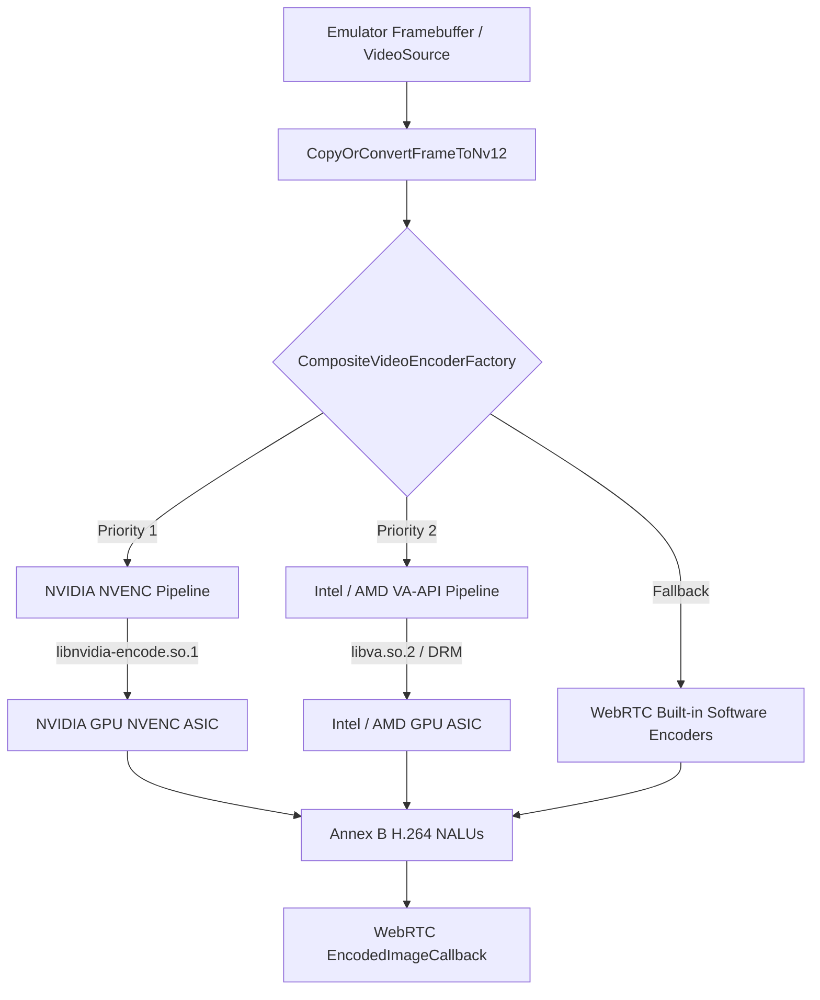
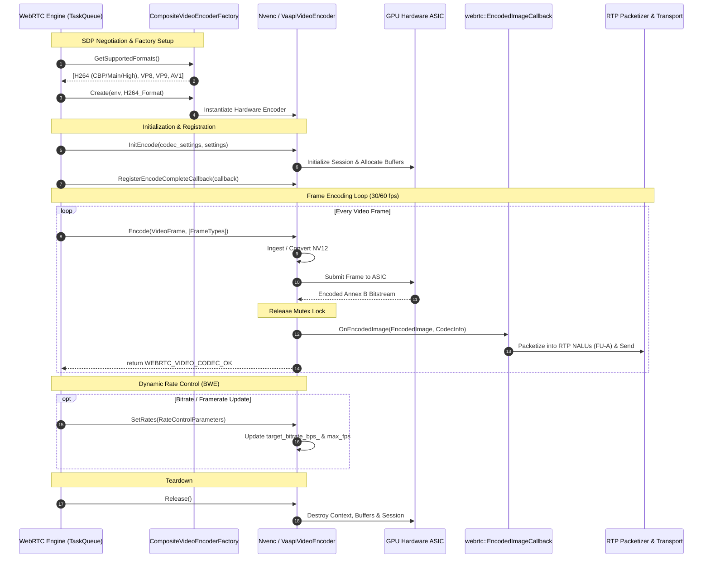

# Linux Hardware Video Encoders for WebRTC VideoBridge

This directory contains the Linux hardware-accelerated H.264 video encoder
pipeline for WebRTC streaming in the Android Emulator (`videobridge`).

---

## 1. Overview & Architecture

Streaming 1080p60 video from the emulator over WebRTC using CPU software
encoding (OpenH264 / VP8) consumes 200–400% CPU on multi-core host systems. This
hardware encoding pipeline offloads pixel encoding to dedicated GPU
fixed-function ASICs (NVIDIA NVENC, Intel QuickSync, AMD VCN), reducing CPU
usage to <5% and latency to single-digit milliseconds.



### Key Design Principles:

1. **Zero Link-Time Dependencies (Dynamic Runtime Loading):**
   - The emulator binary does not hard-link against `libnvidia-encode.so.1`,
     `libva.so.2`, or `libva-drm.so.2`.
   - All driver interfaces are dynamically discovered and resolved at runtime
     via `goldfish::os::DynamicLibrary` (`dlopen`/`dlsym`). If libraries or DRM
     device nodes are absent, the emulator gracefully falls back to built-in
     software encoders without crashing or failing to start.
2. **Unified Frame Ingestion:**
   - Direct zero-transcode memory copy for native `kNV12` buffers via
     `libyuv::CopyPlane`.
   - Optimized fallback conversion for `kI420` frames via `libyuv::I420ToNV12`.
3. **Infinite GOP for Real-Time Streaming:**
   - Configured with `intra_period = 0` (infinite GOP) and on-demand IDR
     keyframe insertion on WebRTC PLI (Picture Loss Indication) packets.

---

## 2. Integration into the WebRTC Framework

The hardware encoders implement WebRTC's standard `webrtc::VideoEncoder` and
`webrtc::VideoEncoderFactory` interfaces. Understanding how they interact with
WebRTC's threading model, callbacks, and rate control is essential:



### 2.1. Threading & Concurrency Model

- **Dedicated Task Queue (`EncoderQueue`):** WebRTC drives frame encoding
  sequentially on a dedicated encoder TaskQueue. Calls to `Encode()` are
  sequential per stream.
- **Asynchronous Rate Control:** WebRTC's bandwidth estimation (BWE) and
  congestion control algorithms run on separate worker/network threads and
  invoke `SetRates()` asynchronously whenever network conditions fluctuate.
- **Thread Safety (`absl::Mutex`):** All encoder state (`width_`, `height_`,
  `target_bitrate_bps_`, session handles) is protected via `absl::Mutex`.
- **Lock-Free Callback Invariant:** `Encode()` extracts the hardware bitstream
  and copies it into `webrtc::EncodedImage` under the lock, then **releases
  `mutex_` before calling `callback->OnEncodedImage()`**. This guarantees that
  downstream WebRTC packetization locks (e.g. `RtpSenderVideo`) cannot cause a
  lock-inversion deadlock with the encoder.

### 2.2. Callback & RTP Packetization Pipeline

- **`webrtc::EncodedImageCallback`:** After GPU ASIC completion, the encoder
  packages Annex B NALUs (SPS, PPS, slice data) into a `webrtc::EncodedImage`
  tagged with `webrtc::kVideoCodecH264` and passes it to the registered
  callback.
- **RTP Slicing:** WebRTC's `RtpPacketizerH264` automatically fragments the
  Annex B bitstream into standard RTP payload units (Single NALU, STAP-A, or
  FU-A fragmentation packets) with RTP timestamps and dispatches them over
  SRTP/ICE.

### 2.3. Keyframe Requests (PLI / FIR)

- In real-time video streaming, periodically inserting keyframes wastes
  bandwidth. The encoder uses an **infinite GOP** (`intra_period = 0`), emitting
  only P-frames during normal operation.
- When a new peer connects or packet loss occurs, WebRTC receives an RTCP
  Picture Loss Indication (PLI) or Full Intra Request (FIR) from the receiver
  and passes `frame_types = [kVideoFrameKey]` to `Encode()`.
- The encoder immediately forces an IDR keyframe (`NV_ENC_PIC_FLAG_FORCEIDR` for
  NVENC, IDR picture parameters for VA-API), clearing reference picture buffers
  and re-emitting fresh SPS/PPS headers.

---

## 3. Hardware Backends

### 3.1. NVIDIA NVENC (`nvenc_*`)

- **Dynamic Loader:** `NvencLoader` loads `libnvidia-encode.so.1` and populates
  `NV_ENCODE_API_FUNCTION_LIST` via `NvEncodeAPICreateInstance`.
- **Supported GPUs:** Turing, Ampere, Ada Lovelace, Hopper, Blackwell, and
  GeForce/Quadro/Tesla series with proprietary drivers >= 470.
- **Rate Control:** Constant Bitrate (`NV_ENC_PARAMS_RC_CBR`) with low-latency
  tuning preset (`NV_ENC_PRESET_LOW_LATENCY_DEFAULT_GUID`).
- **Profile Support:** Constrained Baseline, Main, and High profiles.

### 3.2. Intel & AMD VA-API (`vaapi_*`)

- **Dynamic Loader:** `VaapiLoader` loads `libva.so.2` and `libva-drm.so.2`,
  automatically probing DRM render nodes (`/dev/dri/renderD128`,
  `/dev/dri/renderD129`, etc.).
- **Supported GPUs:**
  - **Intel:** QuickSync Video / Iris Xe / Arc / UHD Graphics via Intel Media
    Driver (`iHD`) or legacy `i965`.
  - **AMD:** Radeon / RadeonSI / VCN via Mesa VA-API driver
    (`radeonsi_drv_video.so`).
- **Low-Power Acceleration:** Supports standard slice encoding
  (`VAEntrypointEncSlice`) and Intel Low-Power slice encoding
  (`VAEntrypointEncSliceLP`).
- **Surface Ingestion:** Uses RAII `ScopedVaapiDerivedImage` to map hardware
  VRAM surfaces directly into host CPU memory, performing zero-copy NV12
  ingestion via `CopyOrConvertFrameToNv12`.

#### Understanding the VA-API Encoding Pipeline (For Newcomers)

Unlike NVIDIA NVENC (which is a high-level black-box driver API), VA-API is an
**open hardware command pipeline** modeled like a 3D GPU render pass.
Understanding how it operates per frame:

1. **Hardware Context & Surface Setup (`VASurfaceID`):**
   - The encoder creates a hardware surface in GPU memory (`vaCreateSurfaces`
     with `VA_FOURCC_NV12`) and a bitstream output buffer
     (`VAEncCodedBufferType`).
2. **Surface Ingestion (`ScopedVaapiDerivedImage`):**
   - Calls `vaDeriveImage` on the surface and maps its linear memory buffer
     (`vaMapBuffer`).
   - Writes the incoming NV12 pixels directly into the surface using
     `CopyOrConvertFrameToNv12` (with single-burst contiguous `std::memcpy`
     fast-path), then unmaps.
3. **Parameter Buffers (The 4 Pillars of H.264 Silicon Encoding):** Before
   triggering the GPU encode pass, the CPU creates 4 parameter buffers
   (`vaCreateBuffer`):
   - **`VAEncSequenceParameterBufferH264` (SPS):** Configures picture
     dimensions, frame rate, profile/level, intra period (infinite GOP = 0), and
     aspect ratio.
   - **`VAEncPictureParameterBufferH264` (PPS):** Configures reference picture
     lists, frame ordering, and forces IDR keyframes when requested by WebRTC.
   - **`VAEncSliceParameterBufferH264` (Slice):** Defines slice boundaries
     (macroblocks $0$ to $\text{total\_macroblocks} - 1$) and slice type
     (`kSliceTypeI` or `kSliceTypeP`).
   - **`VAEncMiscParameterRateControl` (CBR):** Configures the hardware rate
     control engine with average and maximum bitrates (bps).
4. **The Render Pass ("Draw Call"):**
   - `vaBeginPicture(dpy, context, surface)`: Binds the target surface in the
     GPU hardware context.
   - `vaRenderPicture(dpy, context, buffers)`: Submits all 4 parameter buffers
     to the GPU hardware command queue.
   - `vaEndPicture(dpy, context)`: Dispatches the encode job to the GPU
     fixed-function video silicon.
5. **Hardware Synchronization & Bitstream Extraction:**
   - `vaSyncSurface(dpy, surface)`: Blocks CPU until the GPU finishes encoding.
   - `vaMapBuffer(dpy, coded_buf)`: Maps the output bitstream to read a linked
     list of `VACodedBufferSegment` structs containing Annex B H.264 NAL units
     (`0x00 0x00 0x00 0x01 ...`).
   - Emits the frame to WebRTC via `callback_->OnEncodedImage()`.

---

## 4. Composite Dispatcher & Multi-GPU Failover

`CompositeVideoEncoderFactory` orchestrates multi-GPU systems (e.g. laptops with
Intel iGPU + NVIDIA dGPU):

1. **SDP Format Prioritization:** Aggregates supported H.264 profiles from
   available hardware drivers, deduplicates them, and advertises them ahead of
   software codecs so remote WebRTC peers automatically negotiate hardware
   encoding.
2. **Chained Runtime Failover:**
   - If NVIDIA NVENC exhausts its concurrent session quota (a common hardware
     limit on consumer GeForce GPUs) or runs out of VRAM, the encoder creation
     fails gracefully and immediately tries the secondary **Intel/AMD VA-API**
     hardware backend before falling back to software codecs.

---

## 5. Environment Variable Configuration

The hardware encoder backend can be configured or forced at runtime via
`ANDROID_EMU_VIDEO_ENCODER`:

| Value                         | Behavior                                                                      |
| :---------------------------- | :---------------------------------------------------------------------------- |
| `auto` _(default)_            | Automatic chained discovery and failover: **NVENC -> VA-API -> Software**.    |
| `nvenc` / `nvidia`            | Forces NVIDIA NVENC hardware encoder (falls back to software on failure).     |
| `vaapi` / `intel` / `amd`     | Forces Intel/AMD VA-API hardware encoder (falls back to software on failure). |
| `software` / `sw` / `builtin` | Disables hardware encoders and forces WebRTC built-in software encoders.      |

### Example Usage:

```bash
# Force Intel QuickSync hardware encoding (e.g. to conserve battery on laptops)
export ANDROID_EMU_VIDEO_ENCODER=vaapi

# Force Software encoding (e.g. for deterministic debugging)
export ANDROID_EMU_VIDEO_ENCODER=software
```

---

## 6. File Structure

```
core/linux/
├── README.md                          # Architecture and WebRTC integration documentation
├── codec_factories_linux.cc          # Platform factory and CompositeVideoEncoderFactory
├── frame_nv12_converter.h            # Shared zero-copy NV12 and I420 frame converter
├── h264_format_utils.h               # Shared H.264 SDP format matrix generator
├── nvenc_loader.h / .cc              # Dynamic loader for libnvidia-encode.so.1
├── nvenc_video_encoder.h / .cc       # WebRTC VideoEncoder implementation for NVENC
├── nvenc_video_encoder_factory.h/.cc # WebRTC VideoEncoderFactory implementation for NVENC
├── va_api_types.h                    # Decoupled VA-API types, enums, and struct definitions
├── vaapi_loader.h / .cc              # Dynamic loader for libva.so.2 and libva-drm.so.2
├── vaapi_video_encoder.h / .cc       # WebRTC VideoEncoder implementation for VA-API
├── vaapi_video_encoder_factory.h/.cc # WebRTC VideoEncoderFactory implementation for VA-API
└── test/
    ├── fake_nvenc_driver.h / .cc     # In-memory mock driver for NVIDIA NVENC
    ├── fake_vaapi_driver.h / .cc     # In-memory mock driver for Intel/AMD VA-API
    ├── nvenc_loader_test.cc          # Unit tests for NVENC loader
    ├── nvenc_video_encoder_test.cc   # Unit tests for NVENC encoder & factory
    ├── vaapi_loader_test.cc          # Unit tests for VA-API loader & DRM nodes
    ├── vaapi_video_encoder_test.cc   # Unit tests for VA-API encoder & factory
    └── codec_factories_linux_test.cc # Unit tests for composite dispatcher and env overrides
```

---

## 7. Building and Running Tests

All unit tests run hermetically in memory using mock drivers without requiring
physical GPU hardware:

```bash
# Run all Linux video encoder unit tests with clang-tidy verification
bazel test --config tidy \
    @goldfish//emulator/videobridge:codec_factories_linux_test \
    @goldfish//emulator/videobridge:nvenc_loader_test \
    @goldfish//emulator/videobridge:nvenc_video_encoder_test \
    @goldfish//emulator/videobridge:vaapi_loader_test \
    @goldfish//emulator/videobridge:vaapi_video_encoder_test \
    @goldfish//emulator/videobridge:videobridge_tidy
```
