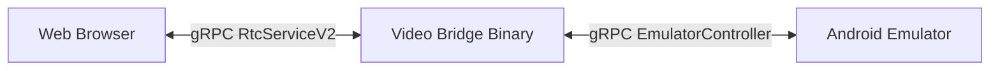
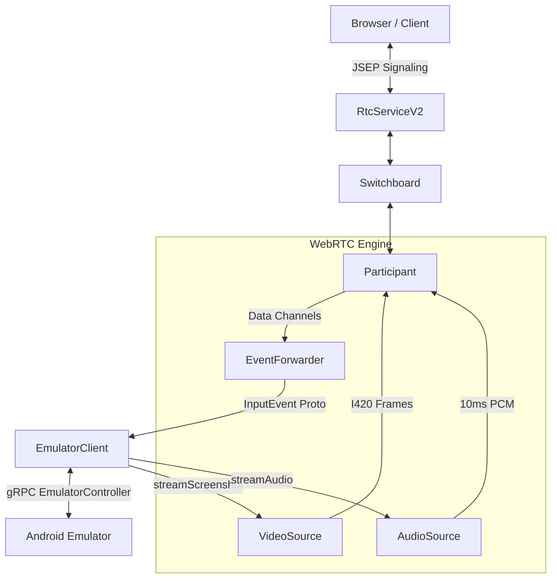

# Modern WebRTC Video Bridge Design

This document details the architecture, design, and internal workings of the
out-of-process WebRTC Video Bridge (`videobridge`) in `emu-main-next`.

---

## 1. High-Level Architecture & "Why"

The `videobridge` is a standalone executable (`cc_binary`) that acts as an
intermediary (proxy) between Web browsers and the Android Emulator.

### The Decoupling Rationale

Decoupling WebRTC into a separate process is highly beneficial for several
reasons:

1. **Dependency Isolation:** The WebRTC stack brings in a massive amount of
   third-party dependencies (SSL libraries, audio/video codecs, network socket
   wrappers). Embedding these directly into the emulator binary increases
   compile times and binary size. Decoupling keeps the core emulator's build
   graph clean and lightweight.
2. **Crash Resiliency:** If the WebRTC connection layer crashes due to network
   stack errors, codec exceptions, or memory leaks, the emulator process itself
   remains unaffected.
3. **Flexible Deployment:** Decoupling allows running the WebRTC gateway on a
   separate machine or container, scaling WebRTC signaling independently from
   the emulator instances.

---

## 2. A WebRTC Primer for Newcomers

To understand why the `videobridge` architecture is structured this way, we must
first understand how WebRTC works under the hood.

### 2.1 Peer-to-Peer (P2P) is Hard

WebRTC is designed to establish direct, low-latency, peer-to-peer audio, video,
and data streams between a browser and a remote endpoint (in this case, our
emulator). However, direct communication over the internet is blocked by
firewalls and Network Address Translators (NATs).

To solve this, WebRTC uses three core concepts:

1. **SDP (Session Description Protocol):** A text format describing the media
   capabilities of an endpoint (e.g., "I support VP8 video, Opus audio, and want
   to receive them at these resolutions").
2. **ICE (Interactive Connectivity Establishment):** A framework used to find
   all possible ways two peers can connect (local IP addresses, public IP
   addresses via STUN servers, or relayed connections via TURN servers). Each
   potential connection path is called an **ICE Candidate**.
3. **Signaling:** Before two peers can talk directly, they must exchange their
   SDPs (the "Offer" and the "Answer") and their ICE Candidates. WebRTC does
   _not_ define a signaling protocol. In our architecture, we use the gRPC
   `RtcServiceV2` endpoint directly for this exchange. If a client requires a
   different transport (like WebSockets to connect to a browser), a lightweight
   proxy gateway can be placed in front of the gRPC interface (as demonstrated
   in [DEMO.md](../gateway/DEMO.md)).

### 2.2 JSEP (JavaScript Session Establishment Protocol)

JSEP is the state machine that governs this exchange:

- **Step 1:** One peer (usually the browser) creates an **Offer** (SDP).
- **Step 2:** The browser sends this Offer to the Video Bridge via the
  **Signaling Channel** (our gRPC `RtcServiceV2`).
- **Step 3:** The Video Bridge applies this offer to its local WebRTC engine
  (`webrtc::PeerConnection`), generates an **Answer** (SDP), and sends it back
  to the browser.
- **Step 4:** Both sides trickle **ICE Candidates** to each other as they
  discover them. Once a viable network path is agreed upon, the P2P media
  connection is established.

---

## 3. Internal Components & Data Flow

Once signaling succeeds, the WebRTC engine takes over. The `videobridge` binary
hosts the following internal components to bridge WebRTC to the emulator:

### 3.1 `EmulatorClient`

A gRPC client wrapper that connects to the emulator's `EmulatorController`
service. It uses `EmulatorGrpcClientBuilder` to discover the emulator's port and
handles gRPC stream reactors for:

- **`StreamScreenshot`**: Requests a continuous stream of BGR24/RGBA screenshots
  from the emulator.
- **`StreamInputEvent`**: Pushes touch, mouse, and keyboard events back into the
  emulator.

### 3.2 `GrpcVideoSource`

A custom `webrtc::AdaptedVideoTrackSource` that coordinates the screenshot
capture loop. It is decoupled from format-specific details by delegating to a
`VideoFormatPipeline`:

- **Shared Memory (MMAP) Transport:** To achieve 60 FPS, the emulator writes
  frame buffers directly to a shared memory file mapped by the Video Bridge,
  eliminating gRPC serialization overhead. The size of the shared memory region
  is queried from the active pipeline.
- **Fallback Transport:** If shared memory mapping fails, it automatically falls
  back to receiving frames via standard gRPC protobuf byte payloads.
- **Multi-Format Extensibility:** Instead of hardcoding format details, it
  delegates gRPC configuration, shared memory sizing, and `webrtc::VideoFrame`
  construction to the injected `VideoFormatPipeline` strategy.

### 3.3 `VideoFormatPipeline`

An abstraction interface that encapsulates format-specific requirements and
conversions:

- **Format Negotiation:** Defines the gRPC `ImageFormat` to request from the
  emulator.
- **Memory Management:** Calculates the exact bytes required in the shared
  memory region for a given frame dimension.
- **Frame Construction:** Converts raw incoming bytes (e.g., RGBA pixels or
  native GPU handle metadata) and constructs the final `webrtc::VideoFrame` with
  the correct rotation and timestamps.
- **Supported Pipelines:**
  - `RgbaToI420Pipeline`: The default pipeline. It requests `RGBA8888` from the
    emulator, converts it to `I420` YUV on the CPU using `libyuv`, and packages
    it into a standard software-backed `VideoFrame`.
  - _Future Pipelines:_ `RgbaToNv12Pipeline` (for hardware-accelerated encoders)
    and `NativeTexturePipeline` (for zero-copy GPU texture streaming).

### 3.3 `Switchboard` & `Participant`

- **`Participant`**: Represents a single WebRTC connection. It wraps the
  `webrtc::PeerConnection` object, listens to WebRTC connection state changes,
  and configures the audio/video tracks.
- **`Switchboard`**: The orchestrator that manages multiple active `Participant`
  sessions. It acts as the routing table for the signaling layer, maintaining
  thread-safe FIFO message queues for each participant so that gRPC signaling
  requests are safely routed to the correct WebRTC signaling threads.

### 3.4 `EventForwarder`

An observer registered on WebRTC **Data Channels**:

- When the browser sends mouse clicks, key presses, or touch coordinates, they
  arrive over WebRTC SCTP data channels as binary protobuf packets.
- `EventForwarder` intercepts these, deserializes them, and writes them directly
  to the emulator's `StreamInputEvent` gRPC channel to inject input into the
  guest OS with sub-millisecond latency.

### 3.5 Platform Codec Factories & Hardware Acceleration

To deliver low-latency high-resolution video streams (such as `1080x2400` @ 60
FPS) without overloading the host CPU, the `videobridge` leverages
platform-specific hardware acceleration for video encoding and decoding.

The bridge instantiates `CompositeVideoEncoderFactory` and
`CompositeVideoDecoderFactory`. These custom wrappers prioritize the platform's
hardware-accelerated H.264 codecs and gracefully fall back to WebRTC's built-in
software codecs (VP8, VP9, AV1) if the hardware encoder fails or is not
supported.

#### Windows (Media Foundation)

On Windows, the bridge implements a custom `MFVideoEncoderH264` using the
Windows Media Foundation API. It enumerates and instantiates a
hardware-accelerated H.264 Encoder MFT (Media Foundation Transform).

- **Format Conversion:** The encoder converts incoming YUV frames to NV12 using
  `libyuv` and feeds them into the MFT.
- **Performance Optimizations:** To minimize heap allocations in the video
  pipeline's hot path, input and output samples/buffers are pre-allocated during
  initialization and reused for subsequent frames.
- **Threading and Lifecycle:** The Media Foundation MFT operates synchronously.
  To prevent race conditions where resources could be released while encoding is
  active, the `Encode` method holds an exclusive mutex lock for its entire
  duration.

#### macOS (VideoToolbox)

_(Planned)_ Future versions will integrate Apple's VideoToolbox framework
(`RTCVideoEncoderFactoryH264`) via the native WebRTC Objective-C wrapper to
support GPU-accelerated video encoding on macOS hosts.

#### Linux (NVIDIA / VA-API)

_(Planned)_ Future versions will implement hardware-accelerated H.264 encoding
on Linux using NVIDIA's NVENC or Intel/AMD's VA-API to support GPU-accelerated
video encoding in Linux cloud environments. Currently, Linux hosts fall back to
WebRTC's built-in software codecs.

---
